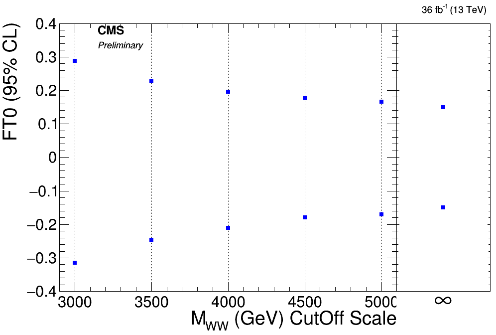

# Plot aQGC plot like



# How to

1. In text file **cutoffscale_FT.dat** and **cutoffscale_FS.dat** aQGC cut-off limit is summarized for FS and FT.
2. To make plot just run

```bash
python plot_FS0.py -b
```

or

```bash
python plot_FT0.py -b
```

3. In code there is boolean for appreance/dis-apprearence of **Preliminary**.
